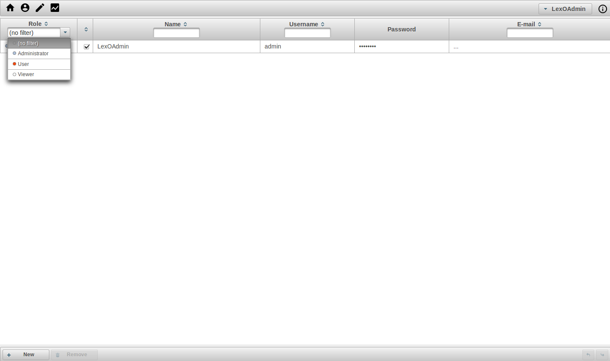
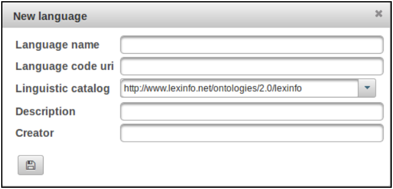
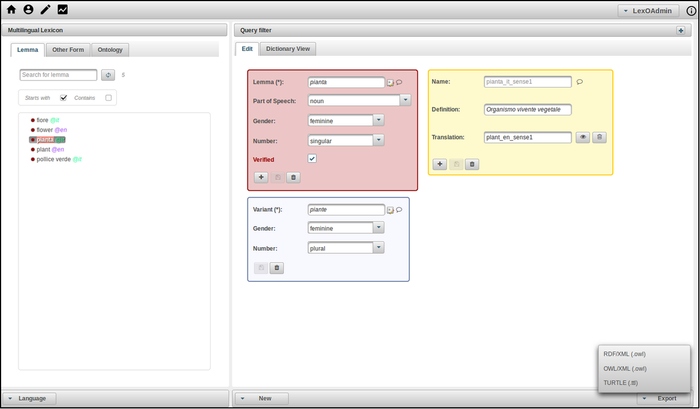
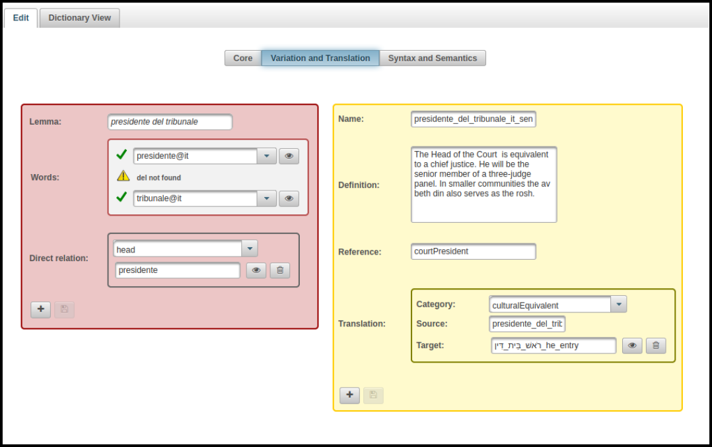
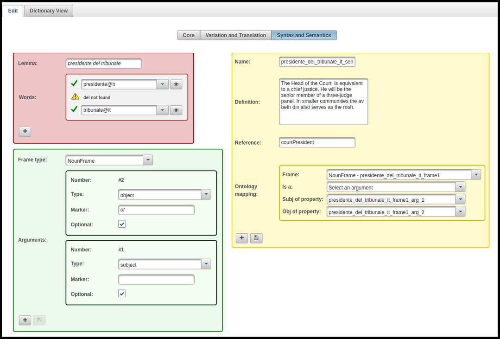

# LexO-lite v1.0

This is the first version of LexO, a collaborative web editor for easily building and managing lexical and terminological resources in the context of the Semantic Web, based on the OntoLex-Lemon model.

<b><h2>Table of content</h2></b>

<ul><li>
  <a href="#what-is-LexO-for">What is LexO for?</a>
</li><li>
  <a href="#who-is-LexO-for">Who is LexO for?</a>
</li><li>
    <a href="#how-to-deploy">How to deploy</a>
</li>
<ul>
  <li>
    <a href="#prepare-the-environment">Preparation of the environment</a>
</li>
    <li>
    <a href="#configuration-file">Initialization and configuration file</a>
</li>
  <li>
    <a href="#run-lexo">Run LexO</a>
</li>
  </ul>
<li>
    <a href="#how-to-use">How to use</a>
</li>
<ul>
  <li>
    <a href="#create-users">Create users</a>
</li>
    <li>
    <a href="#create-lexicon">Create your own lexicon</a>
        <li><a href="#the-core-module">The core module</a></li>
        <li><a href="#the-vartrans-module">The variation and translation module
</a></li>
        <li><a href="#the-synsem-module">The syntax and semantics module</a></li>
</li>
 <li>
    <a href="#statistics">Access to the lexicon statistics</a>
</li>
  <li>
    <a href="#export">Export the resource</a>
</li>
  </ul>
<li>
    <a href="#restapi">LexO's REST API</a>
</li>
<li>
    <a href="#ref">References</a>
</li>
  <li>
    <a href="#relpub">Related Publication</a>
</li>
</ul>

<a name="what-is-LexO-for"><h3>What is LexO for? </h3></a>
<p>
  LexO, a collaborative web editor for easily building and managing lexical and terminological resources in the context of the Semantic Web. The adoption of Semantic Web technologies and the Linked Data paradigm has been driven by the need to ensure the construction of resources that are interoperable and can be shared and reused by the scientific community. 
  
  LexO's primary objective is to enable lexicographers, scholars and humanists to create a resource ex novo where information can be easily manually curated by humans, that is fundamental for collecting reliable, fine-grained, and explicit information. LexO attempts to make the <a href="https://www.w3.org/community/ontolex/wiki/Final_Model_Specification">OntoLex-Lemon</a> model accessible to all those do not have technical skills, allowing the adoption of new technological advances in the Semantic Web by Digital Humanities.

  The first version of LexO deals with: i) the model <a href="https://www.w3.org/2016/05/ontolex/#core">core</a> (lexical entry, form, lexical sense, ontology entity) and uses the <a href="https://www.w3.org/community/ontolex/wiki/Final_Model_Specification#Decomposition_.28decomp.29">decomp</a> module for representing mmulti-wordsultiwords, andii) the <a href="https://www.w3.org/2016/05/ontolex/#variation-translation-vartrans">variation and translation</a> module, iii) the <a href="https://www.w3.org/2016/05/ontolex/#syntax-and-semantics-synsem">syntax and semantics</a> module, iv) part of the <a href="https://www.w3.org/community/ontolex/wiki/Final_Model_Specification#Metadata_.28lime.29">lime</a> module for metadata.

</p>

<a name="who-is-LexO-for"><h3>Who is LexO for? </h3></a>
<p>
The tool allows information to be easily manually curated by humans. LexO's primary objective is to enable lexicographers, scholars and humanists to create a resource ex novo where information can be easily manually curated by humans, that is fundamental for collecting reliable, fine-grained, and explicit information. 
</p>


<a name="how-to-deploy"><h3>How to deploy</h3></a>
<p>
<p>  
Check out the <a href="https://github.com/andreabellandi/LexO-lite/wiki/LexO%E2%80%90lite-Installation-Guide">Installation Guide</a> in the wiki.
</p>  
<a name="prepare-the-environment"><h4>Prepare the environment</h4></a>
  <p>
    LexO requires:
<ul>
  <li>Apache Tomcat v8.0 or later</li>
  <li>MySql v5.0 or later</li>
  <li>Java 1.8</li>
  </ul>
  <br/>
  LexO is a Maven project and uses:
  <br/>
<ul>
  <li><a href="https://github.com/owlcs/owlapi">OWL-API</a> v5.0</li>
  <li><a href="https://github.com/protegeproject/sparql-dl-api">SPARQL-DL</a> v3.0.0</li>
  <li>Hibernate v4.3.7</li>
  <li>Primefaces 7.0</li>
  <li>Jersey RESTful Web Services framework v2.23.2</li>
</ul>
  
<br/>  
 Download LexO-lite source code and compile it.
  </p>
  <a name="configuration-file"><h4>Initialization and configuration file</h4></a>
  <p>
  First of all, you have to create an empty schema in MySql called <b>LexO_users</b> for the users' profiles management. Set the character encoding to UTF-8. You can use the following command:
  </p>
  
```
mysql> create database LexO_users character set UTF8 collate utf8_bin
```  
If you want to use another database name, you have to change it in the hibernate.cfg.xml file and recompile the project.

The lexolite.properties file contains some parameter to configure, as the following:
```
lexiconFolder, is the relative path w.r.t. your home (default value is .LexO-lite/)
lexiconNamespace, is the namespace of your lexicon followed by '#' (default value is http://lexica/mylexicon#)
lexiconFileName, is the file name of your lexicon (default name is mylexicon.owl)
lexiconExportFileName, is the file name of your export (default name is exportedLexicon)

domainOntologyFolder, is the relative path w.r.t. your home (default value is .LexO-lite/)
domainOntologyNamespace, is the namespace of your domain ontology followed by '#' (default value is http://ontologies/myontology#)
domainOntologyFileName, is the file name of your domain ontology (default name is domainOntology.owl)
```  
LexO comes with an empty lexicon having the namespace equals to the init value of the above <i>lexiconNamespace</i> parameter (you can find it in the lexicon folder of the project).
If you place it to the <i>lexiconFolder</i> folder you can run LexO over tomcat, and you are ready for starting to construct your multilingual lexicon.
<br/><br/>
It is important to note that currently LexO has not an ontology import button, so if you want to upload an ontology you have to manually change its namespace to the value stated 
in the <i>domainOntologyNamespace</i> parameter, and place it to the <i>domainOntologyFolder</i> folder.
Then you have to restart tomcat.

<a name="run-lexo"><h4>Run LexO</h4></a>
  <p>
    You can access to the home of LexO by the following url:
  
  ```
  http://localhost:8080/LexO-lite
  ```  
  There are two servlets for creating and populating the database with one administrator user.
  
  ```
  http://localhost:8080/LexO-lite/servlet/domainCreator?command=create
  ```
  creates the database, and 
  
  ```
  http://localhost:8080/LexO-lite/servlet/domainCreator?command=preset
  ```
  creates the administrator user.
  
  </p>

<a name="how-to-use"><h3>How to use</h3></a>
<p>
<a name="create-users"><h4>Create users</h4></a>
  <p>
    Once you created an administrator user, you can use the following credentials to log in to LexO:

 ```
user = admin
password = admin
  ```

By clicking on the user icon placed at the top of the interface, you can manage your users team by means of the panel shown in the following image.
</p>



<p>
Then you can modify user and password of the administrator account and create some users on the basis of the following three profiles:
<ul>
<li>Administrator: this profile is related to the team leader; it can add or remove users to the team, and assign them their profiles. It can create, modify, delete, validate lexical entries, and import the domain ontology.</li>
<li>User: this profile is related to the editor role. It can create, modify, delete lexical entries, and link senses to ontological entities.</li>
<li>Viewer: this profile can only access the dictionary view of lexical entries.</li>
</ul>
</p>

<a name="create-lexicon"><h4>Create your own lexicon</h4></a>

  <p>
By means of the new button at the bottom of the interface, you can create new lexicon languages. The form to fill in is the following:
</p>



<p>
<ul>
<li><i>Language name (mandatory)</i>: the language tag (e.g., "en");
<li><i>Language code uri (optional)</i>: it is recommended to use the Dublin Core language property 
with reference to either <a href="http://www.lexvo.org/"> Lexvo.org</a> or <a href="http://id.loc.gov/vocabulary/iso639-1.html"> The Library of Congress Vocabulary</a>:
<ul>
<li> Lexvo.org codes should be of the form <i>http://www.lexvo.org/id/iso639-3/xxx</i> where <i>xxx</i> is the 3-Letter ISO 639-3 code</li>
<li> Library of Congress codes should be of the form <i>http://id.loc.gov/vocabulary/iso639-1/xx</i> where <i>xx</i> is the 2-Letter ISO 639-1 code</li>
</ul>
</li>
<li><i>Linguistic catalogue (mandatory)</i>: the value is automatically set to LexInfo, an ontology that provides data categories for the OntoLex-Lemon model;</li>
<li><i>Description (optional)</i>: a textual description;</li>
<li><i>Creator (optional)</i>: some reference to the creator of the lexicon language;</li>
</ul>
</p>

<a name="the-core-module"><h5>The core module</h5></a>


<p>
The above figure shows how the LexO interface appears. It is mainly composed of two parts. The leftmost column allows scholars to browse lemmas, forms and senses, according to the OntoLex-Lemon core model. If the resource is multilingual, then users have the possibility of filtering lemmas, forms and senses by language. Information related to the selected entry is shown in the central panel where the system shows the selected lexical entry alongside the lemma (red box), any its forms (blue boxes) and lexical senses (yellow boxes). It is also possible to list the concepts belonging to a reference ontology. When a user selects an entry, the core module is displayed by default. You can switch to the other modules by using the buttons at the top of the interface. In this case the multiword “presidente del tribunale” (“court president”) is shown. By using the suitable menu you can add other forms, new senses, and a see also relationship with an entry belonging to either the lexicon or an external dataset. Finally, the sense of the entry is bound to the object property <i>courtPresident</i> of the imported domain ontology.
</p><p>
Finally, by selecting the “dictionary view” tab, a dictionary-like rendering of all the information related to the selected entry is shown in the central panel of LexO.
</p>

<a name="the-vartrans-module"><h5>The variation and translation module</h5></a>

<p>
The translation variation module consists of two kinds of relations: 1) the semantic relations holding between senses (synonymy, hypernym, ...) and including terminological relations (dialectal, register, chronological, discursive, and dimensional variation) and the translation relation ; 2) the relations linking lexical entries and/or forms, which describe, for example, the morphological and orthographic variations of the word. The above figure presents an example of relation between lexical entries, i.e. “presidente” is the head of “presidente del tribunale”, and a relation between senses, i.e. the cultural italian translation (LexO also uses the <a href="http://purl.org/net/translation-categories"> translation vocabulray</a>) with the original sense associated with the Hebrew term. By clicking on the plus buttons it is possible to add other lexical and senses relations, on the basis of the LexInfo vocabulary.
</p>

<a name="the-synsem-module"><h5>The syntax and semantics module</h5></a>

The syntactic and semantic module describes the syntactic behaviour of a word and its government pattern, namely the actants introduced by the word, their syntactic function and their morpho-syntactic realisation. These syntactic frames need also to be bound to the ontological structures representing their meaning. As a consequence, LexO makes it possible to map the argument of a predicate defined in an ontology and the syntactic argument introduced in a given syntactic frame. 
The above figure depicts an example of noun frame of the term having a subject and an (optional) object that has the preposition “di” (of) as marker. Basically, the term verbalizes the property <i>courtPresident</i> where the subject corresponds to the first argument of the property (i.e., the property domain class), and the object corresponds to the second argument of the property (i.e., the property range class).

<a name="statistics"><h4>Access to the lexicon statistics</h4></a>

<p>
By means of the suitable button at the top of the interface, you can access to some basic lexicon statistics. 
</p>

<p>
The panel shows the lexicon languages, the number of lexical entries, and some metadata. 
If you select a language by clicking on the pie chart, LexO provides specific statistics for that language, including the distribution
of the lexical entries per part of speech.
</p>

<a name="export"><h4>Export</h4></a>
  <p>
Finally, you can export your lexicon in the OntoLex-Lemon model.
It can be done by means of the Export button at the bottom of the toolbar. 
It is possible to serialize the data as XML/RDF or TURTLE as well. 
In this way, the resource is ready for its publication according to the linked data politics.

</p>
</p>

<a name="restapi"><h3>LexO's REST API</h3></a>
<p>
    LexO comes with a basic set of services returning information about your lexicon. Currently LexO implements the following services (let assume that http://localhotst:8080/LexO-lite precedes each of them):
  </p>

| Description | Example of invocation |
| :--- | :--- |
| List all the *lexicon languages* | `/lexicon/languages` |
| List all the *lexicon lemmas* (only lang is mandatory)| `/lexicon/lemmas?lang=l&startswith=a&limit=10` |
| List all the *lemma metadata* | `/lexicon/lemma?id=lemma_id` |
| List all the lemmas involved in a specific *lexico-semantic relation* with a given lemma | `/lexicon/lemmaByRel?lang=l&entry=lemma_id&rel=translation` |
| Get some lexicon *statistics* | `/lexicon/statistics?lang=l` |

<a name="relpub"><h3>Related Publications</h3></a>
<p>
<b>Bellandi Andrea</b>, and <b>Fahad Khan</b>. Lexicography and the Semantic Web: A Demo with LexO. <i>Electronic lexicography in the 21st century</i> (eLex 2019): Smart lexicography: 53–56.
</p>
<p>
<b>Bellandi Andrea</b>, <b>Fahad Khan</b>, and <b>Monica Monachini</b>. Enhancing Lexicography by Means of the Linked Data Paradigm: LexO for CLARIN. In Proceedings of the <i>CLARIN Annual Conference</i> 2019, edited by Kirl Simov and Maria Eskevich, 134–37. Leipzig.
</p>
<p>
<b>Bellandi Andrea</b>, <b>Giovannetti Emiliano</b>, and <b>Piccini Silvia</b> 2018. Collaborative Editing of Lexical and Termino-ontological Resources: a quick introduction to LexO. In <i>XVIII EURALEX International Congress Lexicography in Global Contexts</i> – Book of Abstracts, 17-21 July 2018, Ljubljana, Slovenia, pp. 23-27.
</p>
<p>
<b>Bellandi Andrea</b>, <b>Emiliano Giovannetti</b>, and <b>Anja Weingart.</b> Multilingual and Multiword Phenomena in a lemon Old Occitan Medico-Botanical Lexicon. <i>Information</i> 9, no. 3 (2018): 52.
</p>

<a name="ref"><h3>References</h3></a>
<ul>
<li>
<a href="http://linguistics.okfn.org"> Open Linguistics Working Group</a>
</li>
<li>
<a href="https://linguistic-lod.org/"> Linguistic Linked Open Data Cloud</a>
</li>
<li>
<a href="https://www.w3.org/2016/05/ontolex/"> Lexicon Model for Ontologies</a>: Community Report, 10 May 2016
</li>
<li>
<a href="https://www.w3.org/2019/09/lexicog/"> The OntoLex Lemon Lexicographic Module</a>
</li>
  </ul>
  
